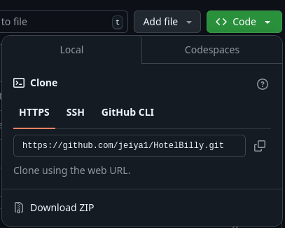
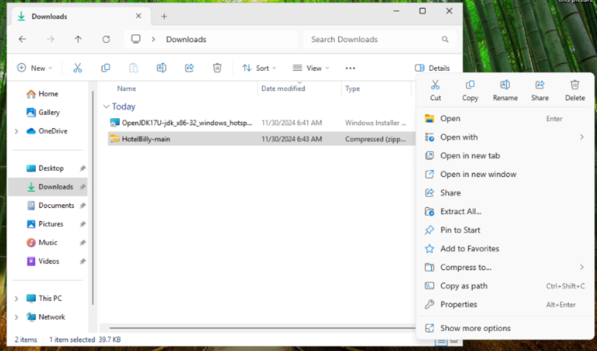
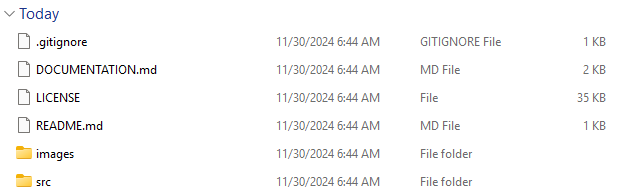
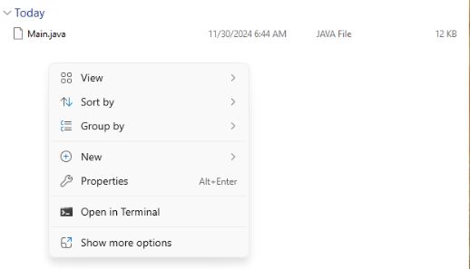

# Hotel Bill Computation

## DESCRIPTION
The Hotel Bill Computation program, HotelBilly, is designed to calculate the total bill for a hotel stay based on the type of room, number of nights stayed, number of guests, and other relevant details. It also collects basic user information for record-keeping purposes.

## USAGE

### Installation

#### Pre-requisites
To use this program, ensure you have any version of supported Java installed on your system. Compile the Java program using a compiler like javac and run the compiled class file.

You can install java from [Adoptimum](https://adoptium.net/installation/). 

#### Installing HotelBilly

**WINDOWS**

1. Open your browser and type https://github.com/jeiya1/HotelBilly.

2. Left-Click on  the `<> Code` button and download the program as a zip file to your desired directory.




3. Open your downloads directory (or folder where the zip file is located in), and then extract the zip file.

Right-click the zip file and then click on `Extract All..`.



Left-click the `Extract` button.


Enter the extracted directory and then enter the src directory.






In the Terminal app, type this:

```powershell
java Main.java
```

4. Enjoy!

**LINUX**

1. Download Java and git.

```bash
sudo apt update && \
sudo apt install -y openjdk-17-jdk git
```

2. Clone the repository.

```bash
git clone https://github.com/jeiya1/HotelBilly.git && \
cd HotelBilly/src
```

3. Run the java program

```bash
java Main.java
```

### Input Parameters

The program takes not argument parameters. You only need to run the program.

### Execution

## CODE STRCUTURE

### Modules

### Program Flow

## EXAMPLES

## ERROR HANDLING

## LIMITATIONS AND KNOWN ISSUES

## CONTRIBUTORS

- lourbirds

- hizmoonlover

- mreatsaf